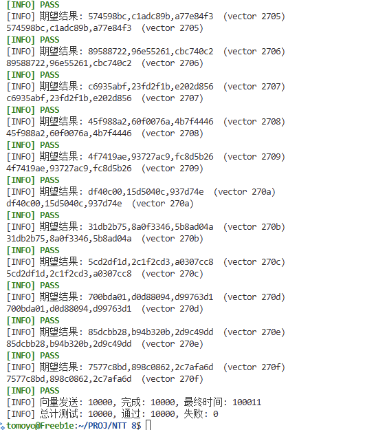
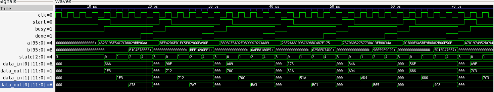
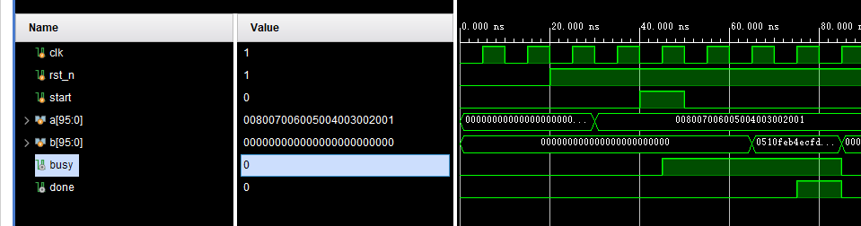

# NTT_8模块说明
---------
## 1.模块要求

根据任务要求，实现一个8点快速数论变换（Number Theoretic Transform，NTT）模块。该模块用于对长度为8的整数序列进行基于模数 q = 3329 的NTT(即NTT中涉及的加、减、乘运算均为模运算)，常应用于格密码学中Kyber算法的多项式乘法加速。NTT的作用是将一个多项式$f=f_0+f_1X+\cdots+f_7X^7$转换到NTT域，即 $NTT\left(f\right)=\hat{f}=\widehat{f_0}+{\hat{f}}_1X+\cdots+{\hat{f}}_7X^7 $，8点NTT的计算公式为$ \hat f_i=\sum_{j=0}^7 f_j ,\zeta^{j(2,\operatorname{BitRe}(v_3(i))+1)} $。NTT模块输入8个12-bit位宽的原始多项式系数f，在固定周期内完成计算并输出8点NTT域多项式系数$\hat{f}$。模块IO接口如表1所示，要求当运算开启信号有效时，读入96-bit数据，随后进行NTT计算，计算过程中，busy信号指示高电平为忙状态，否则为低电平指示空闲状态。在经过固定周期后，done信号由低变高，指示计算完成，同时输出96-bit结果。
## 2.模块接口

| 信号 | 位宽 | 方向 | 描述 |
|------|------|------|------|
| clk    | 1        | Input  | 系统时钟 |
| rst_n  | 1        | Input  | 系统复位，低电平有效 |
| start  | 1        | Input  | 运算开启信号，高电平单周期脉冲有效 |
| a      | 96 (a[95:0]) | Input  | 输入 8 点原始多项式系数（8×12 位或根据设计约定） |
| b      | 96 (b[95:0]) | Output | 输出 8 点 NTT 域多项式系数 |
| busy   | 1        | Output | 模块忙指示，高电平表示正在运算 |
| done   | 1        | Output | 计算完成信号，高电平有效 |
## 3.模块原理
若需再加类型/复位值/时序属性列再告诉我。
模数:
$$
p=3329
$$
选取原根:
$$
g=3
$$
8点NTT需要:

$$
g_n=3^{\frac{3329-1}{8}}=3^{416}(mod 3329)=749
$$

|$g_n^n$|$749^0$|$749^1$|$749^2$|$749^3$|$749^4$|$749^5$|$749^6$|$749^7$|
|---|---|---|---|---|---|---|---|---|
|$g_n^n(mod\enspace3329)$|1|749|1729|40|3328|2580|1600|3289|
|$g_n^n(mod\enspace3329)$|1|749|-1600|40|-1|-749|1600|-40|

参考DFT：
$$
X(k)=\sum_{j=0}^{n-1}x(j)W_n^{jk}, k=0,1,...,n-1
$$
有NTT：
$$
X(k)=\sum_{j=0}^{n-1}x(j)g_n^{jk}, k=0,1,...,n-1
$$
参考FFT简化计算的流程：
原根具有以下性质：
$$
g_n^{n/2}=g^{(p-1)/2} \equiv -1 (mod\enspace p)
$$
这和单位根的性质：
$$
    W_n^{j}=-W_n^{j+n/2}
$$
是类似的。
因此可以用类似FFT的分治方法来计算NTT。
参考按照时间的基2FFT算法组织蝶形结：
$$
\begin{align*}
X(k)&=\sum_{j=0}^{n/2-1}x(2j)g_n^{2jk}+\sum_{j=0}^{n/2-1}x(2j+1)g_n^{(2j+1)k}\\\
&=\sum_{j=0}^{n/2-1}x(2j)g_n^{2jk}+g_n^k\sum_{j=0}^{n/2-1}x(2j+1)g_n^{2jk}\\\
&=E(k)+g_n^kO(k)\\\
X(k+n/2)&=E(k)+g_{n}^{k+n/2}O(k)=E(k)-g_n^kO(k)
\end{align*}
$$

## 4.算法验证
使用python搭建相同结构的蝶形结，并与直接计算得到的结果进行对比验证。
```python
def modmul(a, b, mod):
    return (a * b) % mod
def modadd(a, b, mod):
    return (a + b) % mod
def modsub(a, b, mod):
    return (a - b) % mod


coe = []
butterfly1 = [0]*8
butterfly2 = [0]*8
coe = list(map(int, input("请输入8个系数，用空格分隔: ").split()))
butterfly1 = coe[:]

butterfly2[0] = modadd(butterfly1[0],modmul(butterfly1[4],pow(749,0,3329),3329), 3329)
butterfly2[1] = modsub(butterfly1[0],modmul(butterfly1[4],pow(749,0,3329),3329), 3329)
butterfly2[2] = modadd(butterfly1[2],modmul(butterfly1[6],pow(749,0,3329),3329), 3329)
butterfly2[3] = modsub(butterfly1[2],modmul(butterfly1[6],pow(749,0,3329),3329), 3329)
butterfly2[4] = modadd(butterfly1[1],modmul(butterfly1[5],pow(749,0,3329),3329), 3329)
butterfly2[5] = modsub(butterfly1[1],modmul(butterfly1[5],pow(749,0,3329),3329), 3329)
butterfly2[6] = modadd(butterfly1[3],modmul(butterfly1[7],pow(749,0,3329),3329), 3329)
butterfly2[7] = modsub(butterfly1[3],modmul(butterfly1[7],pow(749,0,3329),3329), 3329)

print("\nframe1变换结果为:")
for i in range(8):
    print(butterfly2[i], end=' ')

butterfly1[0] = modadd(butterfly2[0],modmul(butterfly2[2],pow(749,0,3329),3329), 3329)
butterfly1[1] = modadd(butterfly2[1],modmul(butterfly2[3],pow(749,2,3329),3329), 3329)
butterfly1[2] = modsub(butterfly2[0],modmul(butterfly2[2],pow(749,0,3329),3329), 3329)
butterfly1[3] = modsub(butterfly2[1],modmul(butterfly2[3],pow(749,2,3329),3329), 3329)
butterfly1[4] = modadd(butterfly2[4],modmul(butterfly2[6],pow(749,0,3329),3329), 3329)
butterfly1[5] = modadd(butterfly2[5],modmul(butterfly2[7],pow(749,2,3329),3329), 3329)
butterfly1[6] = modsub(butterfly2[4],modmul(butterfly2[6],pow(749,0,3329),3329), 3329)
butterfly1[7] = modsub(butterfly2[5],modmul(butterfly2[7],pow(749,2,3329),3329), 3329)

print("\nframe2变换结果为:")
for i in range(8):
    print(butterfly1[i], end=' ')

butterfly2[0] = modadd(butterfly1[0],modmul(butterfly1[4],pow(749,0,3329),3329), 3329)
butterfly2[1] = modadd(butterfly1[1],modmul(butterfly1[5],pow(749,1,3329),3329), 3329)
butterfly2[2] = modadd(butterfly1[2],modmul(butterfly1[6],pow(749,2,3329),3329), 3329)
butterfly2[3] = modadd(butterfly1[3],modmul(butterfly1[7],pow(749,3,3329),3329), 3329)
butterfly2[4] = modsub(butterfly1[0],modmul(butterfly1[4],pow(749,0,3329),3329), 3329)
butterfly2[5] = modsub(butterfly1[1],modmul(butterfly1[5],pow(749,1,3329),3329), 3329)
butterfly2[6] = modsub(butterfly1[2],modmul(butterfly1[6],pow(749,2,3329),3329), 3329)
butterfly2[7] = modsub(butterfly1[3],modmul(butterfly1[7],pow(749,3,3329),3329), 3329)

print("\nFNTT变换结果为:")
for i in range(8):
    print(butterfly2[i], end=' ')


orign=[1,749,1729,40,3328,2580,1600,3289]
#直接实现8点NTT的O(n^2)版本
print("\n下面是直接实现8点NTT的O(n^2)版本:")
for i in range(8):
    res = 0
    for j in range(8):
        res += coe[j] * pow(orign[i], j, 3329)
    print(res % 3329, end=' ')
```
## 5.模块实现
### 5.1 模乘模块（采用组合逻辑的REDC模块）
```verilog
module REDC3329_comb(
   // input clk,
   // input rst_n,
    //input en,
    input [WIDTH-1:0] a,
    input [WIDTH-1:0] b,
   // output busy,
    //output done,
    output [WIDTH-1:0] r
    );
    parameter WIDTH = 12;
    parameter MOD = 3329;
    parameter MOD_INV = 3327;
    parameter R2_MOD = 2385; 

    wire [WIDTH-1:0] A_MONT, B_MONT;
    wire [WIDTH-1:0] r_MONT;
    REDC_unit_comb REDC_unit_comb_inst1(
        .a(a),
        .b(R2_MOD),
        .r(A_MONT)
    );
    REDC_unit_comb REDC_unit_comb_inst2(
        .a(b),
        .b(R2_MOD),
        .r(B_MONT)
    );
    REDC_unit_comb REDC_unit_comb_inst3(
        .a(A_MONT),
        .b(B_MONT),
        .r(r_MONT)
    );
    REDC_unit_comb REDC_unit_comb_inst4(
        .a(r_MONT),
        .b(1),
        .r(r)
    );
endmodule

module REDC_unit_comb(
    input [11:0] a,
    input [11:0] b,
    output [11:0] r
);
    parameter WIDTH = 12;
    parameter MOD = 3329;
    parameter MOD_INV = 3327;
    wire [2*WIDTH-1:0] T;
    wire [WIDTH-1:0] m;
    assign T=a*b;
    assign m=((T[WIDTH-1:0])*MOD_INV)&({WIDTH{1'b1}});
    wire [2*WIDTH-1:0] result_raw;
    assign result_raw=(T+m*MOD)>>WIDTH;
    wire [12:0] r_raw;
    assign r_raw=(result_raw[12:0]>=MOD)?(result_raw[12:0]-MOD):result_raw[12:0];
    assign r=r_raw[11:0];
endmodule
```
### 5.2 顶层模块
```verilog
module NTT_8_Top(
    input clk,
    input rst_n,
    input start,
    input [95:0] a,
    output [95:0] b, 
    output busy,
    output done
    );
    reg [11:0] btfly1 [7:0],btfly2 [7:0],btfly3 [7:0];
    wire [11:0] btfly2_next [7:0],btfly3_next [7:0],btflyout [7:0];
    wire [11:0] btfly_next [7:0];
    integer i;
    parameter READY=3'd3,PHASE1=3'd0,PHASE2=3'd1,PHASE3=3'd2,DONE=3'd4;
    reg [2:0] state,next_state;
    always_ff@(posedge clk or negedge rst_n)begin
        if(!rst_n)begin
            state<=READY;
        end else begin
            state<=next_state;
    end
    end
    always_comb begin
        case(state)
            READY:begin
                if(start)begin
                    next_state=PHASE1;
                end else begin
                    next_state=READY;
                end
            end
            PHASE1:begin
                next_state=PHASE2;
            end
            PHASE2:begin
                next_state=PHASE3;
            end
            PHASE3:begin
                next_state=DONE;
            end
            DONE:begin
                next_state=READY;
            end
            default:next_state=READY;
        endcase
    end
    assign busy=(state!=READY);
    assign done=(state==DONE);

    always_ff@(posedge clk or negedge rst_n)begin
        if(!rst_n|state==DONE)begin
            for(i=0;i<8;i=i+1)begin
                btfly1[i]<=12'b0;
                btfly2[i]<=12'b0;
                btfly3[i]<=12'b0;
            end     
        end else begin
            if(state==READY) begin
                for(i=0;i<8;i=i+1)begin
                    btfly2[i]<=12'b0;
                    btfly3[i]<=12'b0;
                end
                btfly1[0]<=a[11:0];
                btfly1[4]<=a[23:12];
                btfly1[2]<=a[35:24];
                btfly1[6]<=a[47:36];
                btfly1[1]<=a[59:48];
                btfly1[5]<=a[71:60];
                btfly1[3]<=a[83:72];
                btfly1[7]<=a[95:84];
            end
            else if(state==PHASE1)begin
                for(i=0;i<8;i=i+1)begin
                    btfly2[i]<=btfly2_next[i];
                end
            end
            else if(state==PHASE2)begin
                for(i=0;i<8;i=i+1)begin
                    btfly3[i]<=btfly3_next[i];
                end
            end
        end
    end
    assign b={btflyout[7],btflyout[6],btflyout[5],btflyout[4],btflyout[3],btflyout[2],btflyout[1],btflyout[0]};
    butterfly_frame1 u_butterfly_frame1(
        .data_in(btfly1),
        .data_out(btfly2_next)
    );
    butterfly_frame2 u_butterfly_frame2(
        .data_in(btfly2),
        .data_out(btfly3_next)
    );
    butterfly_frame3 u_butterfly_frame3(
        .data_in(btfly3),
        .data_out(btflyout)
    );
endmodule


module Modadd3329(
    input [11:0] a,
    input [11:0] b,
    output [11:0] r
    );
    wire [12:0] sum_raw,sum;
    assign sum=a+b;
    assign sum_raw=sum>=3329 ? sum-3329 :sum;
    assign r=sum_raw[11:0];
endmodule

module Modsub3329(
    input [11:0] a,
    input [11:0] b,
    output [11:0] r
    );
    wire [11:0] diff;
    assign diff=a>=b ? a-b : a+3329-b;
    assign r=diff;
endmodule

module butterfly_frame1(
    input [11:0] data_in[7:0],
    output [11:0] data_out[7:0]
    );
    wire [11:0] data_in_mul[3:0];

    REDC3329_comb u_REDC3329_comb_1(
        .a 	(data_in[1]  ),
        .b 	(12'b1  ),
        .r 	(data_in_mul[0]  )
    );
    REDC3329_comb u_REDC3329_comb_2(
        .a 	(data_in[3]  ),
        .b 	(12'b1  ),
        .r 	(data_in_mul[1]  )
    );
    REDC3329_comb u_REDC3329_comb_3(
        .a 	(data_in[5]  ),
        .b 	(12'b1  ),
        .r 	(data_in_mul[2]  )
    );
    REDC3329_comb u_REDC3329_comb_4(
        .a 	(data_in[7]  ),
        .b 	(12'b1  ),
        .r 	(data_in_mul[3]  )
    );

    Modadd3329 u_Modadd3329_0(
        .a 	(data_in[0]  ),
        .b 	(data_in_mul[0]  ),
        .r 	(data_out[0]  )
    );
    Modsub3329 u_Modsub3329_0(
        .a 	(data_in[0]  ),
        .b 	(data_in_mul[0]  ),
        .r 	(data_out[1]  )
    );

    Modadd3329 u_Modadd3329_1(
        .a 	(data_in[2]  ),
        .b 	(data_in_mul[1]  ),
        .r 	(data_out[2]  )
    );
    Modsub3329 u_Modsub3329_1(
        .a 	(data_in[2]  ),
        .b 	(data_in_mul[1]  ),
        .r 	(data_out[3]  )
    );

    Modadd3329 u_Modadd3329_2(
        .a 	(data_in[4]  ),
        .b 	(data_in_mul[2]  ),
        .r 	(data_out[4]  )
    );
    Modsub3329 u_Modsub3329_2(
        .a 	(data_in[4]  ),
        .b 	(data_in_mul[2]  ),
        .r 	(data_out[5]  )
    );

    Modadd3329 u_Modadd3329_3(
        .a 	(data_in[6]  ),
        .b 	(data_in_mul[3]  ),
        .r 	(data_out[6]  )
    );
    Modsub3329 u_Modsub3329_3(
        .a 	(data_in[6]  ),
        .b 	(data_in_mul[3]  ),
        .r 	(data_out[7]  )
    );
endmodule

module butterfly_frame2(
    input [11:0] data_in[7:0],
    output [11:0] data_out[7:0]
    );
    wire [11:0] data_in_mul[3:0];

    REDC3329_comb u_REDC3329_comb_1(
        .a 	(data_in[2]  ),
        .b 	(12'b1  ),
        .r 	(data_in_mul[0]  )
    );
    REDC3329_comb u_REDC3329_comb_2(
        .a 	(data_in[3]  ),
        .b 	(12'd1729  ),
        .r 	(data_in_mul[1]  )
    );
    REDC3329_comb u_REDC3329_comb_3(
        .a 	(data_in[6]  ),
        .b 	(12'b1  ),
        .r 	(data_in_mul[2]  )
    );
    REDC3329_comb u_REDC3329_comb_4(
        .a 	(data_in[7]  ),
        .b 	(12'd1729  ),
        .r 	(data_in_mul[3]  )
    );

    Modadd3329 u_Modadd3329_0(
        .a 	(data_in[0]  ),
        .b 	(data_in_mul[0]  ),
        .r 	(data_out[0]  )
    );
    Modsub3329 u_Modsub3329_0(
        .a 	(data_in[0]  ),
        .b 	(data_in_mul[0]  ),
        .r 	(data_out[2]  )
    );

    Modadd3329 u_Modadd3329_1(
        .a 	(data_in[1]  ),
        .b 	(data_in_mul[1]  ),
        .r 	(data_out[1]  )
    );
    Modsub3329 u_Modsub3329_1(
        .a 	(data_in[1]  ),
        .b 	(data_in_mul[1]  ),
        .r 	(data_out[3]  )
    );

    Modadd3329 u_Modadd3329_2(
        .a 	(data_in[4]  ),
        .b 	(data_in_mul[2]  ),
        .r 	(data_out[4]  )
    );
    Modsub3329 u_Modsub3329_2(
        .a 	(data_in[4]  ),
        .b 	(data_in_mul[2]  ),
        .r 	(data_out[6]  )
    );

    Modadd3329 u_Modadd3329_3(
        .a 	(data_in[5]  ),
        .b 	(data_in_mul[3]  ),
        .r 	(data_out[5]  )
    );
    Modsub3329 u_Modsub3329_3(
        .a 	(data_in[5]  ),
        .b 	(data_in_mul[3]  ),
        .r 	(data_out[7]  )
    );
endmodule

module butterfly_frame3(
    input [11:0] data_in[7:0],
    output [11:0] data_out[7:0]
    );
    wire [11:0] data_in_mul[3:0];

    REDC3329_comb u_REDC3329_comb_1(
        .a 	(data_in[4]  ),
        .b 	(12'b1  ),
        .r 	(data_in_mul[0]  )
    );
    REDC3329_comb u_REDC3329_comb_2(
        .a 	(data_in[5]  ),
        .b 	(12'd749  ),
        .r 	(data_in_mul[1]  )
    );
    REDC3329_comb u_REDC3329_comb_3(
        .a 	(data_in[6]  ),
        .b 	(12'd1729  ),
        .r 	(data_in_mul[2]  )
    );
    REDC3329_comb u_REDC3329_comb_4(
        .a 	(data_in[7]  ),
        .b 	(12'd40  ),
        .r 	(data_in_mul[3]  )
    );

    Modadd3329 u_Modadd3329_0(
        .a 	(data_in[0]  ),
        .b 	(data_in_mul[0]  ),
        .r 	(data_out[0]  )
    );
    Modsub3329 u_Modsub3329_0(
        .a 	(data_in[0]  ),
        .b 	(data_in_mul[0]  ),
        .r 	(data_out[4]  )
    );

    Modadd3329 u_Modadd3329_1(
        .a 	(data_in[1]  ),
        .b 	(data_in_mul[1]  ),
        .r 	(data_out[1]  )
    );
    Modsub3329 u_Modsub3329_1(
        .a 	(data_in[1]  ),
        .b 	(data_in_mul[1]  ),
        .r 	(data_out[5]  )
    );

    Modadd3329 u_Modadd3329_2(
        .a 	(data_in[2]  ),
        .b 	(data_in_mul[2]  ),
        .r 	(data_out[2]  )
    );
    Modsub3329 u_Modsub3329_2(
        .a 	(data_in[2]  ),
        .b 	(data_in_mul[2]  ),
        .r 	(data_out[6]  )
    );

    Modadd3329 u_Modadd3329_3(
        .a 	(data_in[3]  ),
        .b 	(data_in_mul[3]  ),
        .r 	(data_out[3]  )
    );
    Modsub3329 u_Modsub3329_3(
        .a 	(data_in[3]  ),
        .b 	(data_in_mul[3]  ),
        .r 	(data_out[7]  )
    );
endmodule
```
## 5.结果验证
为了检验模块的正确性，首先使用python产生大量的随机测试数据，并将10000条数据存储在a.txt中，参照结果存储在b.txt中。然后使用verilator作为仿真工具，编写仿真脚本，逐次输入结果，并将模块输出与参考结果进行对比，若全部相同则说明模块正确。仿真脚本如下：
### 5.1 产生测试数据
```python
import random

# ----------------- 常量 -----------------
MOD = 3329
ORIGN = [1, 749, 1729, 40, 3328, 2580, 1600, 3289]  # 长度必须为 8
COUNT = 8  # 系数与点数 (固定 8)

# ----------------- 可配置参数 -----------------
NUM = 10000     # 生成数量
SEED = 12345    # 例如 12345
APPEND = False  # True 表示追加

"""核心辅助函数"""

def pack_values(vals):
    # 将 8 个(<4096)值打包成 96 位: vals[0] 低 12bit
    if len(vals) != COUNT:
        raise ValueError("需要 8 个值")
    p = 0
    for i, v in enumerate(vals):
        if not (0 <= v < 4096):
            raise ValueError(f"值 {v} 超出 12-bit 范围")
        p |= (v & 0xFFF) << (12 * i)
    return p

def split_u96_to_3x32(x):
    return (x >> 64) & 0xFFFFFFFF, (x >> 32) & 0xFFFFFFFF, x & 0xFFFFFFFF

def format_3x32(x):
    hi, mid, lo = split_u96_to_3x32(x)
    return f"0x{lo:08X} 0x{mid:08X} 0x{hi:08X}"

# ----------------- 核心计算 -----------------
def compute_outputs(coeffs):
    outputs = []
    for i in range(8):
        res = 0
        for j in range(8):
            res += coeffs[j] * pow(ORIGN[i], j, MOD)       
        outputs.append(res % MOD)
    for v in outputs:
        print(v, end=' ')
    return outputs

# ----------------- 随机生成 -----------------
def gen_coeffs(rng):
     return [rng.randrange(MOD) for _ in range(COUNT)]
    #return 1,2,3,4,5,6,7,8  # 测试固定值

# ----------------- 主流程 -----------------
def generate():
    rng = random.Random(SEED)
    mode = 'a' if APPEND else 'w'
    a_path = 'a.txt'
    b_path = 'b.txt'
    with open(a_path, mode, encoding='utf-8') as fa, open(b_path, mode, encoding='utf-8') as fb:
        for idx in range(1, NUM + 1):
            coeffs = gen_coeffs(rng)
            outputs = compute_outputs(coeffs)
            fa.write(format_3x32(pack_values(coeffs)) + '\n')
            fb.write(format_3x32(pack_values(outputs)) + '\n')
            if NUM <= 20 or idx % max(1, NUM // 10) == 0 or idx == NUM:
                print(f"进度 {idx}/{NUM} ({idx/NUM:.0%})")
    print(f"完成: {NUM} 条测试 -> {a_path} / {b_path}")
    if SEED is not None:
        print(f"随机种子: {SEED}")


if __name__ == '__main__':
    generate()
```
### 5.2 verilator仿真脚本
```c
#include <stdlib.h>
#include <iostream>
#include <fstream>
#include <sstream>
#include <string>
#include <algorithm>
#include <verilated.h>
#include <verilated_vcd_c.h>
#include "VNTT_8_Top.h"
#include "VNTT_8_Top___024root.h"

#define MAX_SIM_TIME 200000
#define C_RED     "\033[1;31m"
#define C_GREEN   "\033[1;32m"
#define C_RESET   "\033[0m"
vluint64_t sim_time = 0; 
int cntall=0,cntpass=0,cntfail=0;


static inline std::string trim(const std::string &s){
    size_t b = s.find_first_not_of(" \t\r\n");
    if(b==std::string::npos) return "";
    size_t e = s.find_last_not_of(" \t\r\n");
    return s.substr(b, e-b+1);
}

int main(int argc, char** argv, char** env) {
    (void)argc; (void)argv; (void)env;
    VNTT_8_Top *dut = new VNTT_8_Top;

    // 打开波形
    Verilated::traceEverOn(true);
    VerilatedVcdC *m_trace = new VerilatedVcdC;
    dut->trace(m_trace, 5);
    m_trace->open("waveform.vcd");

    // 打开输入文件
    std::ifstream fin("a.txt");

    std::ifstream fanswer("b.txt");

    bool awaiting_done = false;      
    bool have_line_buffer = false;   
    uint32_t line_vals[3] = {0,0,0},ans_vals[3]={0,0,0}; 
    size_t vectors_sent = 0;
    size_t vectors_completed = 0;
    std::string line,answer_line;

    // 初始信号
    dut->clk = 0;
    dut->rst_n = 0;
    dut->start = 0;
    uint8_t start_counter=0;
    while (sim_time < MAX_SIM_TIME) {

        if (sim_time == 10) {
            dut->rst_n = 1;
        }

        if (dut->clk == 1) {
            if (!awaiting_done && fin && dut->rst_n) {
                while(fin && !have_line_buffer) {
                    std::getline(fin, line);
                    if(!fin) break;
                    line = trim(line);
                    if(line.empty() || line[0]=='#') continue; 
                    std::stringstream ss(line);
                    ss >> std::hex >> line_vals[2] >> line_vals[1] >> line_vals[0];
                    if(ss.fail()) {
                        std::cerr << "[WARN] 解析失败, 跳过: " << line << std::endl;
                        continue;
                    }
                    have_line_buffer = true;
                }
                if(have_line_buffer) {
                    VlWide<3UL> data_a;
                    std::copy(std::rbegin(line_vals), std::rend(line_vals), std::begin(data_a.m_storage));
                    dut->a = data_a;
                    dut->start = 1; // 拉高 start
                    start_counter=0;
                    awaiting_done = true;
                    have_line_buffer = false;
                    vectors_sent++;
                } else if(!fin && vectors_sent==vectors_completed) {
                    //提前结束
                    break;
                }
            }
            if(dut->start && start_counter<1) {
                start_counter++;
            } else {
                dut->start = 0; 
            }

            if (awaiting_done && dut->done) {
                std::getline(fanswer,answer_line);
                answer_line=trim(answer_line);
                std::stringstream sa(answer_line);
                sa >> std::hex >> ans_vals[2] >> ans_vals[1] >> ans_vals[0];
                std::cout<< "[INFO] 期望结果: "
                    << std::hex
                    << ans_vals[0] << "," << ans_vals[1] << "," << ans_vals[2]
                    << "  (vector " << vectors_completed << ")" << std::endl;
                VlWide<3UL> r = dut->b;
                uint32_t r32[3];
                std::copy(std::rbegin(r.m_storage), std::rend(r.m_storage), std::begin(r32));
                std::cout << std::hex
                          << r32[0] << "," << r32[1] << "," << r32[2]
                          << "  (vector " << vectors_completed << ")" << std::endl;
                if(r32[0]==ans_vals[0] && r32[1]==ans_vals[1] && r32[2]==ans_vals[2]) {
                    std::cout <<C_GREEN<<"[INFO] PASS" <<C_RESET <<std::endl;
                    cntpass++;
                } else {
                    std::cout <<C_RED<<"[ERROR] FAIL" <<C_RESET <<std::endl;
                    cntfail++;
                }
                cntall++;
                dut->start = 0;  
                awaiting_done = false;
                vectors_completed++;
            }
        }

        // 求值与波形
        dut->clk ^= 1;
        dut->eval();
        m_trace->dump(sim_time);
        sim_time++;
    }

    std::cerr << "[INFO] 向量发送: " << vectors_sent
              << ", 完成: " << vectors_completed
              << ", 最终时间: " << sim_time << std::endl;
    std::cerr << "[INFO] 总计测试: " << cntall << ", 通过: " << cntpass << ", 失败: "<< cntfail << std::endl;
    m_trace->close();
    delete dut;
    return 0;
}
```
### 5.3 仿真结果
make run运行之后，命令行得到输出说明10000条测试全部通过。

部分测试波形截图如下：


## 5.4 vivado验证
在vivado上进行小量测试：
```verilog
module tb();
	reg clk = 0;
	reg rst_n = 0;
	reg start = 0;
	reg [95:0] a = 0;
	reg [95:0] b = 0;
	wire busy;
	wire done;

	NTT_8_Top dut (
		.clk(clk),
		.rst_n(rst_n),
		.start(start),
		.a(a),
		.b(b),
		.busy(busy),
		.done(done)
	);

	always #5 clk = ~clk;

	initial begin
		// 复位
		rst_n = 0;
		start = 0;
		a = 0;
		b = 0;
		#20;
		rst_n = 1;
		#10;
		a = {12'd8, 12'd7, 12'd6, 12'd5, 12'd4, 12'd3, 12'd2, 12'd1};
		b = 0; 
		#10;
		start = 1;
		#10;
		start = 0;

		wait(done);
		#10;
		$display("NTT_8_Top done! busy=%b", busy);
		$finish;
	end
endmodule
```
仿真结果如下：
